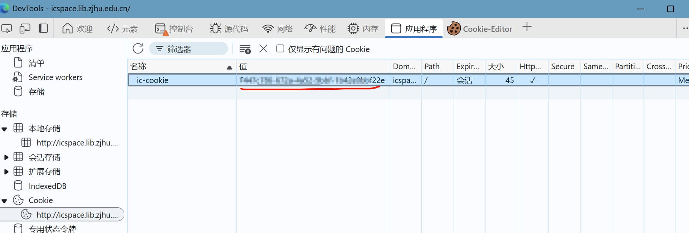
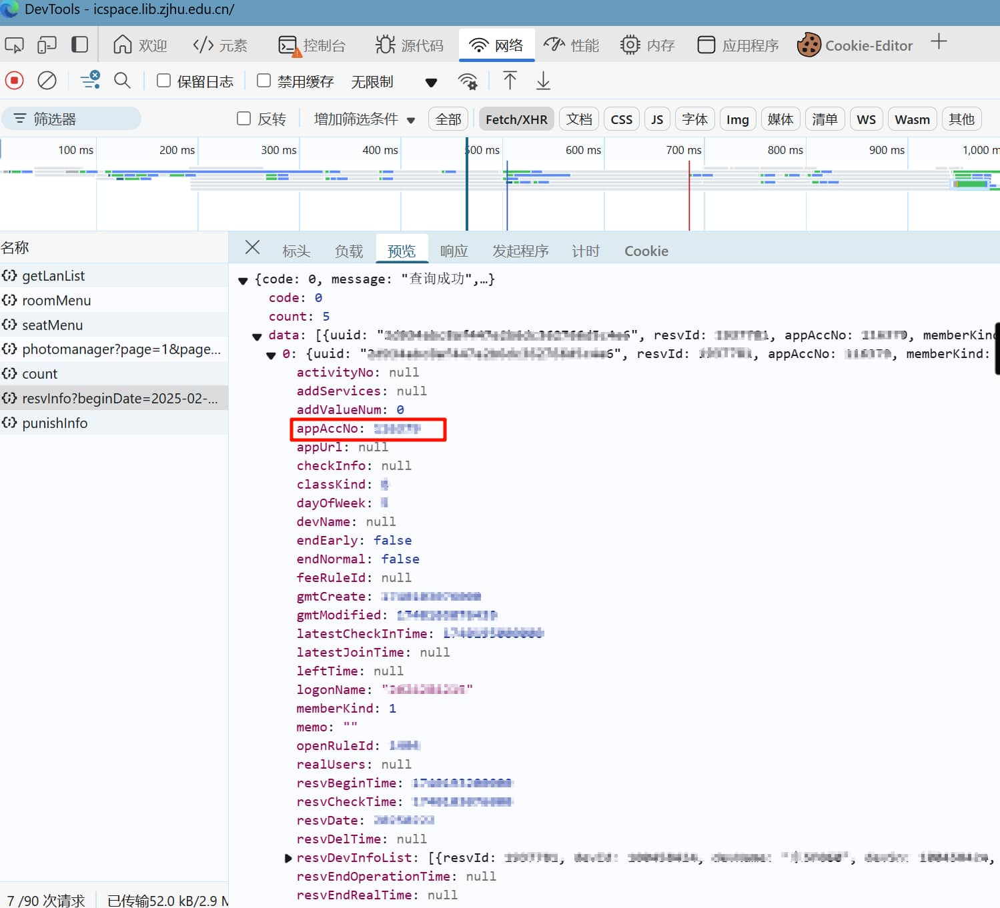
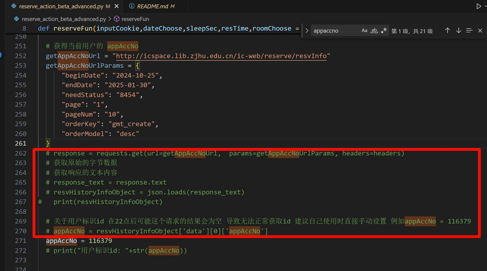

# 湖州师范学院/湖州学院图书馆预定PYTHON
## 支持

目前仅支持东校区4楼和5楼

## 如何使用

目前使用方式比较复杂

需要在进行预定前手动获取到自己的cookie以及appAccNo参数（如果不想改代码的话）

如要使用请下载源代码并执行 **reserve_action_beta_advanced.py** 这个文件

### cookie

进入 http://icspace.lib.zjhu.edu.cn/ 后进行登录 然后f12开发者模式 在**应用程序标签页**中找到 **cookie** 

将其中的 **ic-cookie** 的值进行复制

例图

### appAccNo参数

这个算是图书馆预定平台的用户id

如果不想获取的话就得自己改代码 让程序去获取（但是会降低预定速度）

### 方法一 修改appAccNo参数

还是进入 http://icspace.lib.zjhu.edu.cn/ 后进行登录 然后f12开发者模式 点击 **网络** 标签页

然后刷新页面后 点击 **Fetch/XHR** 按钮

在下方找到 **resvInfo** 的信息

点击 预览 按钮

在预览数据中点击 **data** 然后是 **0**

之后找到 **appAccNo** 参数 将这个值进行复制

例图

然后修改代码中的  **appAccNo = ** 的这个值为你的复制值

### 方法二 改代码实现自动获取appAccNo参数

将红框部分解除注释并将271行（即红框下一行的代码）进行注释即可

## 未来计划

未来可能只需要输入账号和密码即可进行登录 彻底抛弃掉cookie和appAccNo参数

## 联系

邮箱: himweiyeah@qq.com